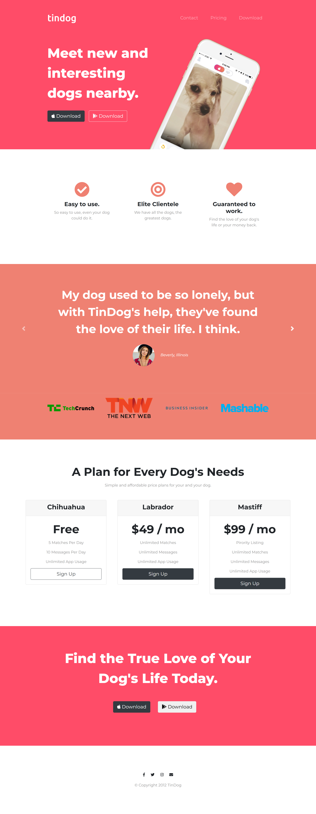

# TinDog — Find Love for Your Dog
TinDog is a modern, responsive landing page for a fictional dog dating app.
Inspired by real-world product landing pages, it showcases clean UI design, responsive layouts, and structured frontend development using HTML, CSS, and Bootstrap.


## Preview 


## Overview
TinDog helps dogs find their perfect match 🐕💖 This project focuses on:
- Building a visually appealing landing page
- Practicing responsive design
- Structuring reusable UI components
- Using Bootstrap effectively


## Features
### 1. Responsive Navigation Bar
* **Feature:** A clean, transparent-to-solid navbar with links for "Contact," "Pricing," and "Download."
* **Bootstrap Component:** `navbar` and `nav-link`. It uses the `navbar-expand` classes to collapse into a "hamburger" menu on smaller mobile screens.

### 2. The Hero Section (Title)
* **Feature:** Catchy headline ("Meet new and interesting dogs nearby") with call-to-action (CTA) download buttons for Apple and Google Play.
* **Visuals:** A rotated iPhone mockup, which is usually achieved using Bootstrap’s Grid System (`col-lg-6`) and some custom CSS `transform: rotate()`.
* **Buttons:** Styled with `btn btn-dark` and `btn-outline-light`.

### 3. Features Section (Iconography)
* **Feature:** Three-column layout highlighting "Easy to use," "Elite Clientele," and "Guaranteed to work."
* **Bootstrap Component:** `row` and `col-lg-4`.
* **Icons:** Likely using Font Awesome icons (Checkmark, Target, Heart) centered with `text-center`.

### 4. Testimonial Carousel
* **Feature:** A sliding section featuring user reviews (e.g., Beverly from Illinois) and press logos (TechCrunch, Mashable, etc.).
* **Bootstrap Component:** `carousel` (with `data-bs-ride="carousel"`). This allows the testimonials to slide automatically or via the side arrows.

### 5. Pricing Table (The "Card" Deck)
* **Feature:** Three distinct tiers (Chihuahua, Labrador, Mastiff) showing different price points and features.
* **Bootstrap Component:** `card`. Specifically:
    - `card-header` for the breed names.
    - `card-body` for the pricing and text.
    - `btn-block` or `w-100` for the full-width signup buttons.

### 6. Call to Action (CTA) & Footer
* **Feature:** A final invitation to download the app at the bottom of the page, followed by social media links and a copyright notice.
* **Bootstrap Component:** `container-fluid` for the full-width colored background and `fab` (Font Awesome Brand) icons for the social links.

## 🛠️ Tech Stack
- HTML5
- CSS3
- Bootstrap 4
- Google Fonts (Montserrat & Ubuntu)
- Font Awesome

## Sections Breakdown
* Navbar — Responsive navigation menu
* Hero Section — App introduction with CTA buttons
* Features — Highlights key app benefits
* Testimonials — Carousel showcasing user feedback
* Press — Media mentions
* Pricing — Subscription plans
* CTA — Final call-to-action
* Footer — Social links and copyright

## ⚙️ How to Run

### 1. Clone the repository:
```bash
git clone https://github.com/your-username/tindog.git
```

### 2.Open the project folder
```bash
cd TinDog
```

### 3. Run:
- Simply open `index.html` in your browser

## Project Structure
```text
TinDog/
├── index.html
├── css/
│   └── styles.css
├── images/
├── assets/        # (screenshots)
```

## Learnings

This project helped me:
- Understand Bootstrap grid and layout system
- Improve CSS structuring and styling practices
- Build responsive designs using media queries
- Organize UI sections like real-world landing pages

## Future Improvements
- Add backend for real user interaction
- Implement authentication
- Convert into a full-stack application
- Add animations (GSAP / Framer Motion)

## A Note
This is a fun and educational project built to strengthen frontend development skills and explore UI design.
